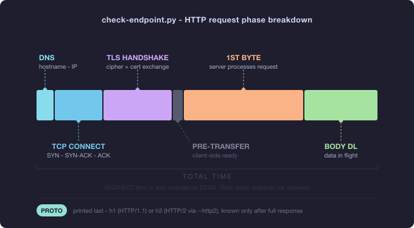

# check-endpoint.py

<p align="center">
  
  
  <a href="https://github.com/bytebeast/check-endpoint/blob/main/LICENSE"></a>
  <a href="https://www.python.org/downloads/"></a>
  <a href="https://github.com/bytebeast/check-endpoint/actions/workflows/github-code-scanning/codeql"></a>
  <a href="https://github.com/bytebeast/check-endpoint/"></a>
</p>

> I originally wrote this script after discovering that curl can independently
> measure each phase of an HTTP connection. I've since vibe-coded it into
> something considerably more complete and robust.

A live, per-phase HTTP timing probe - like `curl -w` on steroids. Each timing
field prints the moment it becomes available, so a hung request visibly stalls
at exactly the phase where it's stuck rather than silently timing out.

<p align="center">
  
</p>

---

## Screenshot


---

## Features

- **Live streaming output** - each phase prints as it completes, not all at once
  at the end
- **Per-phase deltas** - every column is the duration of that phase only, not a
  cumulative total
- **Redirect accounting** - a `REDIRECT` column shows count and total time when
  redirects are followed, explaining why `TOTAL TIME` can exceed the sum of the
  other columns
- **Failure markers** - `<DNS-FAIL>`, `<CONN-FAIL>`, `<TLS-FAIL>`, `<TO>`, and
  more - printed at exactly the phase that failed
- **Clear empty-cell conventions** - a dim `n/a` marks a phase that structurally
  doesn't apply (e.g. `TLS HANDSHAKE` on plain `http://`, or `REDIRECT` when
  none occurred); a dim `-` marks a field that's empty for any other reason
- **IP pinning** - pin repeated requests to one IP to avoid measuring different
  backends across a DNS round-robin
- **Streaming / chunked-transfer testing** - `-S`/`--stream` times every chunk
  as it arrives (not just first/last byte) and reports `CHUNKS`, `AVG GAP`, and
  `MAX GAP` columns - the gaps measured are strictly _between_ chunks, not
  including the first chunk's arrival (that span is already covered by the
  DNS/TCP/TLS/PRE-TRANSFER/1ST BYTE columns) - so you can see whether an SSE or
  chunked response streams smoothly or stalls mid-transfer
- **Catppuccin Mocha color theme** - timing magnitude encoded in color (cool
  blues for fast, warm peach/red for slow); auto-disabled when output is piped
- **curl-compatible flags** - `-H`, `-d`, `-X`, `-4`/`-6`, `-F`, `-a`,
  `-p`/`-P`, `-S`
- **HTTP/2 support** - `--http2` requests HTTP/2 via ALPN negotiation; a `PROTO`
  column (printed last, after `TOTAL BYTES`) shows the protocol actually used
  (`h1` or `h2`); falls back gracefully to HTTP/1.1
- **Body and header support** - POST payloads, auth headers, custom content
  types; works against authenticated and stateful endpoints

---

## What Can It Find?

Run with `-c 10` or `-c 20` to surface patterns invisible in a single request.

### DNS & Resolution

- **Slow or flaky resolvers** - high or variable DNS times across runs
- **Missing local DNS cache** - DNS stays high every request instead of dropping
  to ~0ms after the first lookup
- **Short TTLs** - DNS spikes when the record expires mid-test
- **`<DNS-FAIL>`** - hostname cannot be resolved at all

### TCP & Network

- **Geographic latency** - high TCP CONNECT reveals round-trip time to the
  server
- **Connection backlog** - TCP time grows as the server runs out of accept queue
  capacity under load
- **Firewall / filtering** - `<CONN-FAIL>` on specific ports or from specific
  network paths

### TLS & Security

- **Missing session resumption** - TLS time stays high on every repeat request
  instead of dropping after the first; compare run 1 vs run 2+
- **Slow OCSP validation or long cert chains** - consistently elevated TLS time
  even without load
- **`<TLS-FAIL>`** - expired cert, hostname mismatch, or untrusted CA

### Server Processing (`1ST BYTE` - most diagnostic column)

- **Slow backend** - high 1ST BYTE reveals heavy server work: DB queries, auth
  checks, computation, rendering
- **Queue depth behind a reverse proxy** - fast TCP but slow 1ST BYTE means the
  proxy accepted the connection but the backend was busy
- **Backend inconsistency** - variable 1ST BYTE across runs reveals hot/cold
  cache states, uneven DB load, or connection pool exhaustion
- **Classic pattern: high `1ST BYTE` + fast `BODY DL`** - server is slow to
  produce the response but fast to deliver it; the bottleneck is computation or
  IO server-side, not the network
- **Slow DB providing response data** - consistently high 1ST BYTE while BODY DL
  is fast points directly at backend data retrieval time

### Body Transfer & Server-side IO

- **Slow server IO** - high BODY DL relative to content size (slow disk reads,
  DB result streaming)
- **Bandwidth throttling** - BODY DL scales disproportionately with response
  size
- **Inconsistent content size** - `TOTAL BYTES` varies across `-c N` runs:
  reveals A/B tests, CDN inconsistencies, partial or truncated responses, or
  outright payload bugs

### Streaming Responses (SSE / Chunked Transfer) - `-S`/`--stream`

Without `-S`, a streaming response is still measured meaningfully: `1ST BYTE` is
the time until the first chunk/token arrives, and `BODY DL` is the total
duration of the whole stream. What's missing without `-S` is the _rhythm_ of the
stream - whether it arrives steadily or in bursts with stalls.

`AVG GAP` and `MAX GAP` measure the time strictly _between_ chunks - the first
chunk's arrival is deliberately excluded, since that span is already the DNS +
TCP + TLS + PRE-TRANSFER + 1ST BYTE columns; counting it again here would
misreport ordinary connection setup as if it were an in-stream stall. With fewer
than 2 chunks there's no inter-chunk gap to measure, so both columns correctly
show `n/a` rather than a misleading number.

- **Token stutter / uneven generation** - a large gap between `AVG GAP` and
  `MAX GAP` means the stream paused somewhere in the middle, even though
  `BODY DL` and `TOTAL TIME` look fine in aggregate. This is exactly the kind of
  thing that makes a chat UI feel like it "hangs then dumps text."
- **Buffering misconfigurations** - if a reverse proxy is accidentally buffering
  the whole response before forwarding it (a common `nginx proxy_buffering`
  misconfiguration), `CHUNKS` collapses to 1 or 2, `AVG GAP`/ `MAX GAP` show
  `n/a`, and `1ST BYTE` balloons to roughly equal `TOTAL TIME` - the "stream"
  isn't actually streaming.
- **Inconsistency across backend replicas** - combine with `IP ADDRESS` to see
  whether one particular backend produces the stutter (uneven load, resource
  pressure) while others stream smoothly.
- **Works with auth and POST bodies** - `-S` composes with `-H`/`-d`/`-X`, so
  you can test real chat-completion or SSE endpoints directly:
  `-X POST -d '{"stream": true, ...}' -H "Authorization: Bearer ..." -S`

### Intermittent & Flaky Behavior

- **Mixed response codes** - running `-c 20` surfaces occasional 502/503 mixed
  with 200s, revealing backend instability, pods cycling in Kubernetes, or
  upstream timeouts
- **Intermittent timeouts** - one or two `<TO>` markers among otherwise
  successful requests indicate connection pool exhaustion, GC pauses, or health
  check races
- **Outlier requests** - a single request dramatically slower than the rest
  reveals cold cache misses, JVM garbage collection pauses, or lock contention

### HTTP/2 Protocol

- **Verify HTTP/2 is actually active** - `--http2` with the `PROTO` column
  (rightmost column) confirms whether the server is serving `h2` or falling back
  to `h1`. Useful to verify CDN or load balancer HTTP/2 configuration.
- **Connection reuse visible in timing** - on repeated `-c N` runs with
  `--http2`, TCP CONNECT and TLS HANDSHAKE drop to `<1ms` from run 2 onwards,
  confirming the persistent connection is being reused - one of HTTP/2's main
  performance benefits.
- **Detect HTTP/2 connection issues** - if `PROTO` shows `h1` despite `--http2`,
  the server or an intermediate proxy is downgrading the connection.

### Load Balancing & Round-Robin

- **Uneven backends** - without `-P`, different IPs per request show which
  backends are in rotation; timing differences per IP identify the slow ones
- **Isolate one backend** - use `-P` to pin all requests to a single IP; then
  switch IPs to compare them individually
- **Backend-specific errors** - correlate the `IP ADDRESS` column with
  `HTTP CODE` to see which backend is misbehaving

### Authentication & Specific Endpoints

- **Authenticated APIs** - use `-H "Authorization: Bearer token"` to test
  protected endpoints; `<AUTH-FAIL>` or 401/403 reveals auth configuration
  problems
- **POST/PUT/PATCH endpoints** - use
  `-d @payload.json -H "Content-Type: application/json" -X PUT` to test write
  endpoints with real payloads
- **Token expiry under load** - combine auth headers with `-c 20` to observe if
  validation degrades or fails on repeated calls
- **Header-conditional behavior** - send routing or feature-flag headers
  (`-H "X-Feature: beta"`) to test conditional server logic

### Client-Side

- **Non-zero `PRE-TRANSFER`** - this phase is internal libcurl bookkeeping and
  is normally ~0ms; consistently high values indicate CPU pressure on the
  machine running the script

---

## Installation

```bash
# Recommended: install pycurl in a pyenv virtualenv
pyenv virtualenv 3.12.0 check-endpoint-env
pyenv activate check-endpoint-env
pip install pycurl

# Or install into the system Python directly
pip install pycurl --break-system-packages

# macOS may need:  brew install curl
# Linux may need:  apt install libcurl4-openssl-dev

chmod +x check-endpoint.py
```

---

## Usage

```
./check-endpoint.py <url>
./check-endpoint.py [options] <url>
```

### Examples

```bash
# Single request
./check-endpoint.py https://example.com

# 10 requests with a 5-second timeout
./check-endpoint.py -c 10 -t 5 https://example.com

# Force IPv6, use Chrome's User-Agent
./check-endpoint.py -6 -a chrome https://example.com

# Custom auth header
./check-endpoint.py -H "Authorization: Bearer xyz123" https://api.example.com/v1/data

# Multiple headers
./check-endpoint.py -H "X-Trace-Id: 42" -H "Accept: application/json" https://example.com

# POST a JSON body (implies POST automatically)
./check-endpoint.py -d '{"foo":"bar"}' -H "Content-Type: application/json" https://example.com/api

# POST from a file (curl-style @file)
./check-endpoint.py -d @payload.json -H "Content-Type: application/json" https://example.com/api

# Force a specific method
./check-endpoint.py -X PUT https://example.com/api/resource/1

# Force a fresh DNS lookup + new connection on every repeat
./check-endpoint.py -c 10 -F https://example.com

# Pin all repeats to the first resolved IP (avoids round-robin drift)
./check-endpoint.py -c 10 -P https://example.com

# Pin to a specific known IP
./check-endpoint.py -c 10 -p 93.184.216.34 https://example.com

# Test an SSE / chunked-streaming endpoint and see per-chunk cadence
./check-endpoint.py -c 10 -S -H "Accept: text/event-stream" https://example.com/stream

# Stream mode against a real chat-completion endpoint (auth + POST body)
./check-endpoint.py -X POST -d '{"stream": true, "prompt": "hi"}' \
    -H "Content-Type: application/json" -H "Authorization: Bearer xyz123" \
    -S https://api.example.com/v1/chat
```

---

## Options

| Flag                              | Description                                                                                                                                   |
| --------------------------------- | --------------------------------------------------------------------------------------------------------------------------------------------- |
| `-c N` / `--count N`              | Number of requests to perform (default: 1)                                                                                                    |
| `-t N` / `--timeout N`            | Per-request timeout in seconds (default: 10)                                                                                                  |
| `-4` / `--ipv4`                   | Force IPv4 resolution (default)                                                                                                               |
| `-6` / `--ipv6`                   | Force IPv6 resolution                                                                                                                         |
| `-a ALIAS` / `--user-agent ALIAS` | Use a baked-in UA string: `chrome`, `firefox`, `edge`, `safari`, `googlebot`                                                                  |
| `-H 'K: V'` / `--header`          | Custom request header, repeatable                                                                                                             |
| `-d DATA` / `--data`              | Request body (POST); prefix with `@` to read from a file                                                                                      |
| `-X METHOD` / `--request`         | Force an HTTP method (e.g. `PUT`, `DELETE`)                                                                                                   |
| `-F` / `--force-dns`              | Disable libcurl's DNS cache and connection reuse                                                                                              |
| `-P` / `--auto-pin`               | Resolve once, then pin all repeats to that IP                                                                                                 |
| `-p IP` / `--pin-ip IP`           | Pin all repeats to a specific IP address                                                                                                      |
| `-S` / `--stream`                 | Time the gaps between chunks as they arrive and report `CHUNKS`/`AVG GAP`/`MAX GAP` - for testing SSE or chunked-transfer streaming responses |

---

## Columns

| Column          | Description                                                                                                                                                                             |
| --------------- | --------------------------------------------------------------------------------------------------------------------------------------------------------------------------------------- |
| `#`             | Request number                                                                                                                                                                          |
| `IP ADDRESS`    | IP address libcurl connected to                                                                                                                                                         |
| `DNS`           | Duration of DNS lookup (phase only)                                                                                                                                                     |
| `TCP CONNECT`   | Duration of TCP handshake (phase only)                                                                                                                                                  |
| `TLS HANDSHAKE` | Duration of TLS negotiation; `n/a` for plain `http://`                                                                                                                                  |
| `PRE-TRANSFER`  | Time from connect-ready to request-send-ready; typically ~0ms on direct HTTPS                                                                                                           |
| `1ST BYTE`      | Time from request sent to first byte of response - the clearest indicator of server-side processing time                                                                                |
| `REDIRECT`      | Count and total time of any redirects followed; `n/a` when none. This is why `TOTAL TIME` can exceed the sum of other columns.                                                          |
| `BODY DL`       | Time to receive the complete response body after the first byte                                                                                                                         |
| `TOTAL TIME`    | End-to-end wall-clock time including all redirects (the only cumulative column)                                                                                                         |
| `HTTP CODE`     | HTTP response status code                                                                                                                                                               |
| `TOTAL BYTES`   | Response body size received                                                                                                                                                             |
| `PROTO`         | HTTP version actually used - `h1` (HTTP/1.1) or `h2` (HTTP/2). Teal for h2, dim for h1.                                                                                                 |
| `CHUNKS`        | _(only with `-S`)_ Number of chunks the response body arrived in                                                                                                                        |
| `AVG GAP`       | _(only with `-S`)_ Average time between consecutive chunks, excluding the first chunk's arrival (already covered by 1ST BYTE and the columns before it); `n/a` with fewer than 2 chunks |
| `MAX GAP`       | _(only with `-S`)_ Longest of those inter-chunk gaps - a high `MAX GAP` relative to `AVG GAP` reveals a mid-stream stall; `n/a` with fewer than 2 chunks                                |

`CHUNKS`, `AVG GAP`, and `MAX GAP` only appear when `-S`/`--stream` is passed;
without it, the columns end at `PROTO` and the rest of the table is unaffected.

> **Note on `PRE-TRANSFER = 0ms`:** This is correct behavior for direct HTTPS
> connections. Once TLS completes, libcurl is immediately ready to transfer -
> the gap between those two timers is genuinely near zero.
>
> **Note on `TLS HANDSHAKE` appearing on `http://` URLs:** This is correct when
> the URL redirected to `https://`. The TLS column shows the handshake for the
> final connection; the redirect itself appears in the `REDIRECT` column.
>
> **Note on empty cells:** a dim `n/a` means the phase structurally doesn't
> apply to this request (e.g. `TLS HANDSHAKE` on plain `http://`, or `REDIRECT`
> when none were followed). A dim `-` means the field is empty for any other
> reason (e.g. truncated by a failure mid-transfer).
>
> **Note on `-S` and request bodies:** `-S` only changes how the _response_ is
> measured - it has no effect on what you send. Combine it with `-X`/`-d` as
> usual to test POST/PUT streaming endpoints with a body.
>
> **Note on `AVG GAP`/`MAX GAP` excluding the first chunk:** these two columns
> intentionally start counting from the _second_ chunk onward. Including the
> first chunk's arrival would double-count the same span already shown by
> DNS/TCP/TLS/PRE-TRANSFER/1ST BYTE, which would misreport ordinary connection
> setup time as an in-stream stall. With fewer than 2 chunks there's nothing to
> measure a gap between, so both columns show `n/a`.

---

## Failure Markers

| Marker        | Meaning                                           |
| ------------- | ------------------------------------------------- |
| `<TO>`        | Request timed out (`-t`/`--timeout` exceeded)     |
| `<DNS-FAIL>`  | DNS resolution failed                             |
| `<CONN-FAIL>` | TCP connection refused or failed                  |
| `<TLS-FAIL>`  | TLS handshake or certificate verification failed  |
| `<NO-DATA>`   | Connection succeeded but server sent nothing back |
| `<SEND-FAIL>` | Failed to send the request mid-transfer           |
| `<RECV-FAIL>` | Failed to receive the response mid-transfer       |
| `<RDR-FAIL>`  | Too many redirects                                |
| `<BAD-URL>`   | Malformed URL                                     |
| `<AUTH-FAIL>` | Authentication denied                             |
| `<DENIED>`    | Remote access denied                              |
| `<ERR>`       | Any other libcurl error                           |

Markers are printed at the phase where failure occurred. All subsequent columns
for that row are left blank (`-`), and the next request (if `-c N > 1`) still
runs.

---

## Color Scheme (Catppuccin Mocha)

Colors are auto-disabled when output is piped to a file or another command.

| Element               | Color                                                        |
| --------------------- | ------------------------------------------------------------ |
| Header row            | Bold blue                                                    |
| Odd rows              | Primary text                                                 |
| Even rows             | Slightly dimmed                                              |
| `<1ms`                | Dim (sub-millisecond)                                        |
| `1-9ms`               | Sky blue - fast                                              |
| `10-99ms`             | Teal - moderate                                              |
| `≥100ms`              | Yellow/peach - getting slow                                  |
| Seconds               | Bold peach - slow                                            |
| Minutes               | Bold red - very slow                                         |
| `REDIRECT`            | Peach                                                        |
| Error markers         | Bold red                                                     |
| `n/a` and `-`         | Dim overlay (same shade as the row number)                   |
| `2xx` codes           | Green                                                        |
| `3xx` codes           | Mauve                                                        |
| `4xx` codes           | Maroon                                                       |
| `5xx` codes           | Bold red                                                     |
| Bytes                 | Green → yellow → peach → red (B → KB → MB → GB)              |
| IP address            | Lavender                                                     |
| Row number            | Dim                                                          |
| `CHUNKS`              | Primary text (row color)                                     |
| `AVG GAP` / `MAX GAP` | Same magnitude-based timing colors as other duration columns |

---

## Last Note

If you find this useful, please consider starring the repo ⭐, it helps others
find it.

---

## License

MIT
