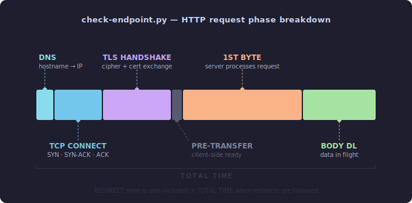
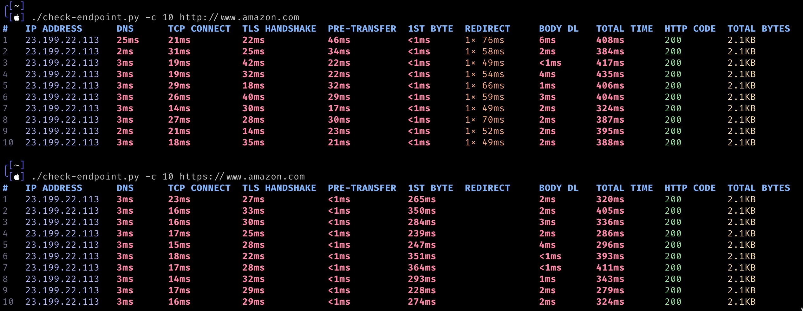

# check-endpoint.py


> I originally wrote this script after discovering that curl can independently
> measures each phase of an HTTP connection. I've since vibe-coded it into
> something considerably more complete and robust.

A live, per-phase HTTP timing probe, like `curl -w` on steroids. Each timing
field prints the moment it becomes available, so a hung request visibly stalls
at exactly the phase where it's stuck rather than silently timing out.



---

## Screenshot



---

## Features

- **Live streaming output**:each phase prints as it completes, not all at once
  at the end
- **Per-phase deltas**:every column is the duration of that phase only, not a
  cumulative total
- **Redirect accounting**:a `REDIRECT` column shows count and total time when
  redirects are followed, explaining why `TOTAL TIME` can exceed the sum of the
  other columns
- **Failure markers**:`<DNS-FAIL>`, `<CONN-FAIL>`, `<TLS-FAIL>`, `<TO>`, and
  more, printed at exactly the phase that failed
- **IP pinning**:pin repeated requests to one IP to avoid measuring different
  backends across a DNS round-robin
- **Catppuccin Mocha color theme**:timing magnitude encoded in color (cool blues
  for fast, warm peach/red for slow); auto-disabled when output is piped
- **curl-compatible flags**:`-H`, `-d`, `-X`, `-4`/`-6`, `-F`, `-a`, `-p`/`-P`
- **Body and header support**:POST payloads, auth headers, custom content types;
  works against authenticated and stateful endpoints

---

## What Can It Find?

Run with `-c 10` or `-c 20` to surface patterns invisible in a single request.

### DNS & Resolution

- **Slow or flaky resolvers**:high or variable DNS times across runs
- **Missing local DNS cache**:DNS stays high every request instead of dropping
  to ~0ms after the first lookup
- **Short TTLs**:DNS spikes when the record expires mid-test
- **`<DNS-FAIL>`**:hostname cannot be resolved at all

### TCP & Network

- **Geographic latency**:high TCP CONNECT reveals round-trip time to the server
- **Connection backlog**:TCP time grows as the server runs out of accept queue
  capacity under load
- **Firewall / filtering**:`<CONN-FAIL>` on specific ports or from specific
  network paths

### TLS & Security

- **Missing session resumption**:TLS time stays high on every repeat request
  instead of dropping after the first; compare run 1 vs run 2+
- **Slow OCSP validation or long cert chains**:consistently elevated TLS time
  even without load
- **`<TLS-FAIL>`**:expired cert, hostname mismatch, or untrusted CA

### Server Processing (`1ST BYTE`, most diagnostic column)

- **Slow backend**:high 1ST BYTE reveals heavy server work: DB queries, auth
  checks, computation, rendering
- **Queue depth behind a reverse proxy**:fast TCP but slow 1ST BYTE means the
  proxy accepted the connection but the backend was busy
- **Backend inconsistency**:variable 1ST BYTE across runs reveals hot/cold cache
  states, uneven DB load, or connection pool exhaustion
- **Classic pattern: high `1ST BYTE` + fast `BODY DL`**:server is slow to
  produce the response but fast to deliver it; the bottleneck is computation or
  IO server-side, not the network
- **Slow DB providing response data**:consistently high 1ST BYTE while BODY DL
  is fast points directly at backend data retrieval time

### Body Transfer & Server-side IO

- **Slow server IO**:high BODY DL relative to content size (slow disk reads, DB
  result streaming)
- **Bandwidth throttling**:BODY DL scales disproportionately with response size
- **Inconsistent content size**:`TOTAL BYTES` varies across `-c N` runs: reveals
  A/B tests, CDN inconsistencies, partial or truncated responses, or outright
  payload bugs

### Intermittent & Flaky Behavior

- **Mixed response codes**:running `-c 20` surfaces occasional 502/503 mixed
  with 200s, revealing backend instability, pods cycling in Kubernetes, or
  upstream timeouts
- **Intermittent timeouts**:one or two `<TO>` markers among otherwise successful
  requests indicate connection pool exhaustion, GC pauses, or health check races
- **Outlier requests**:a single request dramatically slower than the rest
  reveals cold cache misses, JVM garbage collection pauses, or lock contention

### Load Balancing & Round-Robin

- **Uneven backends**:without `-P`, different IPs per request show which
  backends are in rotation; timing differences per IP identify the slow ones
- **Isolate one backend**:use `-P` to pin all requests to a single IP; then
  switch IPs to compare them individually
- **Backend-specific errors**:correlate the `IP ADDRESS` column with `HTTP CODE`
  to see which backend is misbehaving

### Authentication & Specific Endpoints

- **Authenticated APIs**:use `-H "Authorization: Bearer token"` to test
  protected endpoints; `<AUTH-FAIL>` or 401/403 reveals auth configuration
  problems
- **POST/PUT/PATCH endpoints**:use
  `-d @payload.json -H "Content-Type: application/json" -X PUT` to test write
  endpoints with real payloads
- **Token expiry under load**:combine auth headers with `-c 20` to observe if
  validation degrades or fails on repeated calls
- **Header-conditional behavior**:send routing or feature-flag headers
  (`-H "X-Feature: beta"`) to test conditional server logic

### Client-Side

- **Non-zero `PRE-TRANSFER`**:this phase is internal libcurl bookkeeping and is
  normally ~0ms; consistently high values indicate CPU pressure on the machine
  running the script

---

## Installation

```bash
# Recommended: install pycurl in a pyenv virtualenv
pyenv virtualenv 3.12.0 check-endpoint-env
pyenv activate check-endpoint-env
pip install pycurl

# Or install into the system Python directly
pip install pycurl --break-system-packages

# macOS may need:  brew install curl
# Linux may need:  apt install libcurl4-openssl-dev

chmod +x check-endpoint.py
```

---

## Usage

```
./check-endpoint.py <url>
./check-endpoint.py [options] <url>
```

### Examples

```bash
# Single request
./check-endpoint.py https://example.com

# 10 requests with a 5-second timeout
./check-endpoint.py -c 10 -t 5 https://example.com

# Force IPv6, use Chrome's User-Agent
./check-endpoint.py -6 -a chrome https://example.com

# Custom auth header
./check-endpoint.py -H "Authorization: Bearer xyz123" https://api.example.com/v1/data

# Multiple headers
./check-endpoint.py -H "X-Trace-Id: 42" -H "Accept: application/json" https://example.com

# POST a JSON body (implies POST automatically)
./check-endpoint.py -d '{"foo":"bar"}' -H "Content-Type: application/json" https://example.com/api

# POST from a file (curl-style @file)
./check-endpoint.py -d @payload.json -H "Content-Type: application/json" https://example.com/api

# Force a specific method
./check-endpoint.py -X PUT https://example.com/api/resource/1

# Force a fresh DNS lookup + new connection on every repeat
./check-endpoint.py -c 10 -F https://example.com

# Pin all repeats to the first resolved IP (avoids round-robin drift)
./check-endpoint.py -c 10 -P https://example.com

# Pin to a specific known IP
./check-endpoint.py -c 10 -p 93.184.216.34 https://example.com
```

---

## Options

| Flag                              | Description                                                                  |
| --------------------------------- | ---------------------------------------------------------------------------- |
| `-c N` / `--count N`              | Number of requests to perform (default: 1)                                   |
| `-t N` / `--timeout N`            | Per-request timeout in seconds (default: 10)                                 |
| `-4` / `--ipv4`                   | Force IPv4 resolution (default)                                              |
| `-6` / `--ipv6`                   | Force IPv6 resolution                                                        |
| `-a ALIAS` / `--user-agent ALIAS` | Use a baked-in UA string: `chrome`, `firefox`, `edge`, `safari`, `googlebot` |
| `-H 'K: V'` / `--header`          | Custom request header, repeatable                                            |
| `-d DATA` / `--data`              | Request body (POST); prefix with `@` to read from a file                     |
| `-X METHOD` / `--request`         | Force an HTTP method (e.g. `PUT`, `DELETE`)                                  |
| `-F` / `--force-dns`              | Disable libcurl's DNS cache and connection reuse                             |
| `-P` / `--auto-pin`               | Resolve once, then pin all repeats to that IP                                |
| `-p IP` / `--pin-ip IP`           | Pin all repeats to a specific IP address                                     |

---

## Columns

| Column          | Description                                                                                                                    |
| --------------- | ------------------------------------------------------------------------------------------------------------------------------ |
| `#`             | Request number                                                                                                                 |
| `IP ADDRESS`    | IP address libcurl connected to                                                                                                |
| `DNS`           | Duration of DNS lookup (phase only)                                                                                            |
| `TCP CONNECT`   | Duration of TCP handshake (phase only)                                                                                         |
| `TLS HANDSHAKE` | Duration of TLS negotiation; blank for plain `http://`                                                                         |
| `PRE-TRANSFER`  | Time from connect-ready to request-send-ready; typically ~0ms on direct HTTPS                                                  |
| `1ST BYTE`      | Time from request sent to first byte of response, the clearest indicator of server-side processing time                        |
| `REDIRECT`      | Count and total time of any redirects followed; blank when none. This is why `TOTAL TIME` can exceed the sum of other columns. |
| `BODY DL`       | Time to receive the complete response body after the first byte                                                                |
| `TOTAL TIME`    | End-to-end wall-clock time including all redirects (the only cumulative column)                                                |
| `HTTP CODE`     | HTTP response status code                                                                                                      |
| `TOTAL BYTES`   | Response body size received                                                                                                    |

> **Note on `PRE-TRANSFER = 0ms`:** This is correct behavior for direct HTTPS
> connections. Once TLS completes, libcurl is immediately ready to transfer, the
> gap between those two timers is genuinely near zero.
>
> **Note on `TLS HANDSHAKE` appearing on `http://` URLs:** This is correct when
> the URL redirected to `https://`. The TLS column shows the handshake for the
> final connection; the redirect itself appears in the `REDIRECT` column.

---

## Failure Markers

| Marker        | Meaning                                           |
| ------------- | ------------------------------------------------- |
| `<TO>`        | Request timed out (`-t`/`--timeout` exceeded)     |
| `<DNS-FAIL>`  | DNS resolution failed                             |
| `<CONN-FAIL>` | TCP connection refused or failed                  |
| `<TLS-FAIL>`  | TLS handshake or certificate verification failed  |
| `<NO-DATA>`   | Connection succeeded but server sent nothing back |
| `<SEND-FAIL>` | Failed to send the request mid-transfer           |
| `<RECV-FAIL>` | Failed to receive the response mid-transfer       |
| `<RDR-FAIL>`  | Too many redirects                                |
| `<BAD-URL>`   | Malformed URL                                     |
| `<AUTH-FAIL>` | Authentication denied                             |
| `<DENIED>`    | Remote access denied                              |
| `<ERR>`       | Any other libcurl error                           |

Markers are printed at the phase where failure occurred. All subsequent columns
for that row are left blank, and the next request (if `-c N > 1`) still runs.

---

## Color Scheme (Catppuccin Mocha)

Colors are auto-disabled when output is piped to a file or another command.

| Element       | Color                                           |
| ------------- | ----------------------------------------------- |
| Header row    | Bold blue                                       |
| Odd rows      | Primary text                                    |
| Even rows     | Slightly dimmed                                 |
| `<1ms`        | Dim (sub-millisecond)                           |
| `1–9ms`       | Sky blue, fast                                  |
| `10–99ms`     | Teal, moderate                                  |
| `≥100ms`      | Yellow/peach, getting slow                      |
| Seconds       | Bold peach, slow                                |
| Minutes       | Bold red, very slow                             |
| `REDIRECT`    | Peach                                           |
| Error markers | Bold red                                        |
| `2xx` codes   | Green                                           |
| `3xx` codes   | Mauve                                           |
| `4xx` codes   | Maroon                                          |
| `5xx` codes   | Bold red                                        |
| Bytes         | Green → yellow → peach → red (B → KB → MB → GB) |
| IP address    | Lavender                                        |
| Row number    | Dim                                             |

---

## Last Note

If you find this useful, please consider starring the repo ⭐, it helps others
find it

## License

MIT
