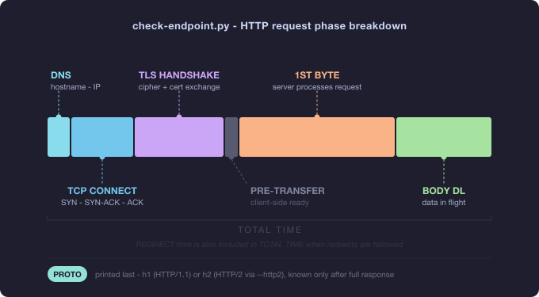
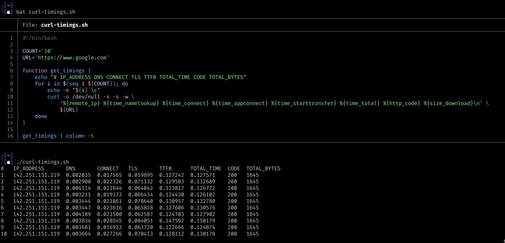
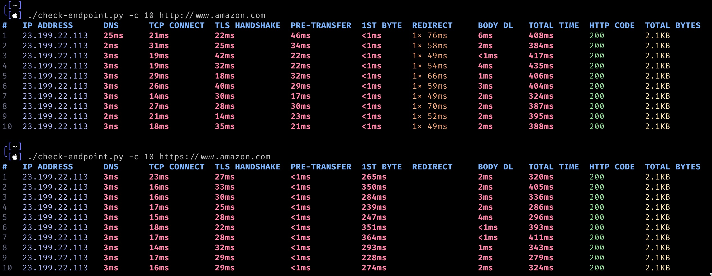
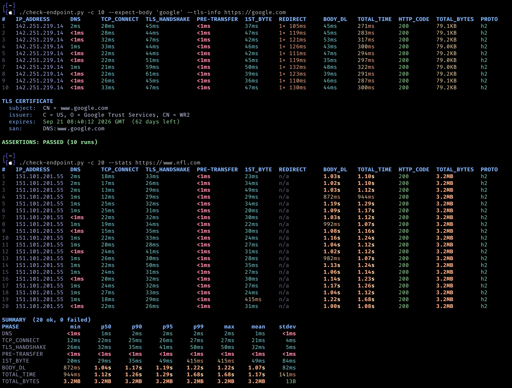

# check-endpoint.py

<p align="center">
  
  
  <a href="https://github.com/bytebeast/check-endpoint/blob/main/LICENSE"></a>
  <a href="https://www.python.org/downloads/"></a>
  <a href="https://github.com/bytebeast/check-endpoint/"></a><br>
  <a href="https://github.com/bytebeast/check-endpoint/actions/workflows/github-code-scanning/codeql"></a>
  <a href="https://github.com/bytebeast/check-endpoint/actions/workflows/ruff.yml"></a>
  <a href="https://github.com/bytebeast/check-endpoint/actions/workflows/python-security.yml"></a>
  <a href="https://github.com/bytebeast/check-endpoint/actions/workflows/contrib-checks.yml"></a>
  <a href="https://github.com/bytebeast/check-endpoint/actions/workflows/image.yml"></a>
</p>

> I originally wrote this script after discovering that curl can independently
> measure each phase of an HTTP connection. I've since vibe-coded it into
> something considerably more complete and robust.

**_A live, per-phase HTTP timing probe_**, like `curl -w` on steroids using
`pycurl`. Each timing field prints the moment it becomes available, so a hung
request visibly stalls at exactly the phase where it's stuck rather than
silently timing out.

**Built for checking internal and external endpoints from the outside in**,
especially the ones you don't control or can't get shell access to: a
third-party API, a partner's service, a backend hidden behind a load balancer or
CDN. When the endpoint owner insists "everything looks fine on our end" but your
users say otherwise, `check-endpoint` gives you independent, client-side,
per-phase evidence of exactly where the time goes (or where it breaks), so you
can point at the real problem instead of guessing. Add `--assert-status` /
`--max-*` to turn that evidence into a pass/fail check, or `--prometheus` to
watch it continuously.

<p align="center">
  
</p>

---

## Screenshots

This is how it would be done using only curl.


My script provides the same functionality as curl, but because it's built with
pycurl, I have much finer programmatic control over the output and can customize
it in ways that aren't as convenient with the curl command-line interface.



---

## Features

- **Live streaming output** - each phase prints as it completes, not all at once
  at the end
- **Per-phase deltas** - every column is the duration of that phase only, not a
  cumulative total
- **Redirect accounting** - a `REDIRECT` column shows count and total time when
  redirects are followed, explaining why `TOTAL_TIME` can exceed the sum of the
  other columns
- **Failure markers** - `<DNS-FAIL>`, `<CONN-FAIL>`, `<TLS-FAIL>`, `<TO>`, and
  more - printed at exactly the phase that failed
- **Clear empty-cell conventions** - a dim `n/a` marks a phase that structurally
  doesn't apply (e.g. `TLS_HANDSHAKE` on plain `http://`, or `REDIRECT` when
  none occurred); a dim `-` marks a field that's empty for any other reason
- **IP pinning** - pin repeated requests to one IP to avoid measuring different
  backends across a DNS round-robin
- **Streaming / chunked-transfer testing** - `-S`/`--stream` times every chunk
  as it arrives (not just first/last byte) and reports `CHUNKS`, `AVG_GAP`, and
  `MAX_GAP` columns - the gaps measured are strictly _between_ chunks, not
  including the first chunk's arrival (that span is already covered by the
  DNS/TCP/TLS/PRE-TRANSFER/1ST_BYTE columns) - so you can see whether an SSE or
  chunked response streams smoothly or stalls mid-transfer
- **Catppuccin Mocha color theme** - timing magnitude encoded in color (cool
  blues for fast, warm peach/red for slow); auto-disabled when output is piped
- **curl-compatible flags** - `-H`, `-d`, `-X`, `-4`/`-6`, `-F`, `-a`,
  `-p`/`-P`, `-S`, `-b`/`-j`
- **Cookie support** - `-b`/`--cookie` sends a literal cookie string or reads
  from a file, curl-style; `-j`/`--cookie-jar` writes accumulated cookies out in
  Netscape jar format (curl calls this `-c`, taken here by `--count`, so it's
  remapped to `-j`); `--show-cookies` prints everything sent or received.
  Cookies persist across every `-c N` run in the same invocation, so login flows
  and session-affinity behavior can be tested across repeated requests, not just
  one
- **HTTP/2 support** - `--http2` requests HTTP/2 via ALPN negotiation; a `PROTO`
  column (printed last, after `TOTAL_BYTES`) shows the protocol actually used
  (`h1`, `h1.0`, `h2`, or `h3`); falls back gracefully to HTTP/1.1
- **Body and header support** - POST payloads, auth headers, custom content
  types; works against authenticated and stateful endpoints
- **Percentile summary** - `--stats` reports min / p50 / p90 / p95 / p99 / max /
  mean / stdev per phase across `-c N` runs, so you see tail latency and jitter,
  not just a single sample
- **Built-in assertions (CI / cron ready)** - `--assert-status`, `--max-total`,
  `--max-ttfb`, `--max-dns`/`--max-tcp`/`--max-tls`/`--max-download` make the
  probe exit non-zero if any request breaches, so it drops straight into
  pipelines and alerting
- **Response body validation** - `--expect-body` and `--expect-regex` fail the
  run when the body is wrong, not just when the status code is
- **TLS certificate inspection** - `--tls-info` prints the certificate issuer,
  expiry with days remaining (colored yellow as it nears expiry, red once
  expired), and Subject Alternative Names
- **Response header capture** - `--show-headers` prints selected response
  headers and a detected cache `HIT`/`MISS` verdict, handy for debugging CDNs
  and proxies
- **Per-request provenance** - `--server-hints` prints, for every request, the
  headers that reveal which server, edge, CDN, or backend answered (`server`,
  `via`, `x-served-by`, `x-cache`, `cf-ray`, `x-amz-cf-pop`, `x-backend`, and
  more), then classifies each header as constant, varied, or per-request so you
  can see at a glance which backend served each of your `-c N` requests
- **Custom header capture** - `--capture-header NAME` (repeatable) tracks any
  specific response header you name and shows its value per request in the same
  summary; missing values render as `-`
- **CDN hop flattening** - by default, comma-chained CDN/cache headers
  (`x-served-by`, `x-cache`, `x-cache-hits`, `via`) are collapsed to just the
  final hop (the edge that actually served you) with the chain depth noted,
  making multi-hop Fastly/Varnish output readable; pass `--full-cdn` to see
  every hop in the chain
- **Prometheus exporter mode** - `--prometheus` runs as a pull-based exporter
  daemon that re-probes on every scrape; see
  [contrib/check-endpoint-exporter](contrib/check-endpoint-exporter/README.md)
- **Runs as a container** - a CLI image for probing from inside the network you
  are debugging: a Kubernetes pod, a CI job, a bastion. No pycurl build
  required; see
  [contrib/check-endpoint-cli](contrib/check-endpoint-cli/README.md)

---

## What Can It Find?

Some of the cases below are ones I have run into myself. The others are common
or fairly obvious issues that are simply worth having written down. Either way
this is not an exhaustive list, and each column can point at plenty of things
not covered here. If you know of a root cause that belongs under one of these
columns, whether it drives up latency, produces intermittent failures, or just
makes a column read strangely, please
[open an issue](https://github.com/bytebeast/check-endpoint/issues) and I will
add it.

Run with `-c 10` or `-c 20` to surface patterns invisible in a single request.

Sections below follow the **left-to-right order of the output columns**, so you
can read a row of output and jump straight to the section for whichever column
looks wrong. Every column has a section; the two at the end are cross-column and
are driven by flags rather than by a single field.

| Column                           | Section                        |
| -------------------------------- | ------------------------------ |
| `#`                              | Run count, warm-up & outliers  |
| `IP_ADDRESS`                     | Load balancing & round-robin   |
| `DNS`                            | DNS & resolution               |
| `TCP_CONNECT`                    | TCP & network                  |
| `TLS_HANDSHAKE`                  | TLS & security                 |
| `PRE-TRANSFER`                   | Client-side & proxy setup      |
| `1ST_BYTE`                       | Server processing              |
| `REDIRECT`                       | Redirect chains                |
| `BODY_DL`                        | Body transfer & server-side IO |
| `TOTAL_TIME`                     | End-to-end budget              |
| `HTTP_CODE`                      | Status codes & flakiness       |
| `TOTAL_BYTES`                    | Response size & content drift  |
| `PROTO`                          | HTTP version                   |
| `CHUNKS` / `AVG_GAP` / `MAX_GAP` | Streaming responses (`-S`)     |

---

### `[#]` - Run count, warm-up & outliers

- **Warm-up on run 1** - the first request pays for cold DNS, a fresh TCP
  handshake, and a full TLS negotiation; runs 2+ reuse all three. Compare run 1
  against the rest before concluding anything is slow. If runs 2+ _don't_ drop,
  that itself is the finding (see the `DNS`, `TCP_CONNECT` and `TLS_HANDSHAKE`
  sections)
- **Outlier requests** - a single request dramatically slower than the rest
  reveals cold cache misses, JVM garbage collection pauses, or lock contention
- **Intermittent timeouts** - one or two `<TO>` markers among otherwise
  successful requests indicate connection pool exhaustion, GC pauses, or health
  check races
- **How many runs you need** - `-c 10` is enough to spot round-robin and obvious
  flakiness; `--stats` p95/p99 only become meaningful around `-c 20` and up

### `[IP_ADDRESS]` - Load balancing & round-robin

- **Uneven backends** - without `-P`, different IPs per request show which
  backends are in rotation; timing differences per IP identify the slow ones
- **Isolate one backend** - use `-P` to pin all requests to a single IP; then
  switch IPs to compare them individually
- **Backend-specific errors** - correlate the `IP_ADDRESS` column with
  `HTTP_CODE` to see which backend is misbehaving
- **Rotation mid-test** - the IP changing partway through a `-c N` run means a
  DNS TTL expired and the resolver handed back a different member of the pool
- **One IP is not one server** - behind a CDN or an anycast address, every
  request hits the same IP while landing on different edge nodes. `IP_ADDRESS`
  cannot see that; `--server-hints` can
- **IPv4 vs IPv6 paths differ** - run `-4` and `-6` separately against the same
  host; a large gap points at a misconfigured or unoptimised AAAA path

### `[DNS]` - DNS & resolution

- **Slow or flaky resolvers** - high or variable DNS times across runs
- **Missing local DNS cache** - DNS stays high every request instead of dropping
  to ~0ms after the first lookup
- **Short TTLs** - DNS spikes when the record expires mid-test
- **libcurl's own cache hides the real cost** - runs 2+ normally show ~0ms
  because libcurl caches within the process, not because your resolver is fast.
  Use `-F` to force a fresh lookup every run and measure the true cost
- **Deep CNAME chains** - a hostname pointing through several CNAMEs before the
  final A/AAAA record costs extra round-trips, showing as consistently elevated
  DNS even on a healthy resolver
- **`<DNS-FAIL>`** - hostname cannot be resolved at all

### `[TCP_CONNECT]` - TCP & network

- **Geographic latency** - high TCP_CONNECT reveals round-trip time to the
  server
- **Connection backlog** - TCP time grows as the server runs out of accept queue
  capacity under load
- **Firewall / filtering** - `<CONN-FAIL>` on specific ports or from specific
  network paths
- **Connection reuse not happening** - TCP should collapse to ~0ms from run 2
  onwards. If it stays high on every run without `-F`, something is closing the
  connection each time: `Connection: close`, a proxy, or a load-balancer idle
  timeout
- **Packet loss** - an occasional TCP time several times the median, with the
  rest steady, suggests a lost SYN being retransmitted
- **A proxy shortens what you're measuring** - with a proxy in the path this
  column is the time to the _proxy_, not to the origin

### `[TLS_HANDSHAKE]` - TLS & security

- **Missing session resumption** - TLS time stays high on every repeat request
  instead of dropping after the first; compare run 1 vs run 2+
- **Slow OCSP validation or long cert chains** - consistently elevated TLS time
  even without load
- **TLS 1.2 vs 1.3** - 1.3 completes in one round-trip and 1.2 needs two, so a
  handshake at roughly twice the TCP time suggests the server negotiated 1.2
- **`n/a` on an `http://` URL is expected**; a _value_ here on an `http://` URL
  means the request was redirected to HTTPS - check the `REDIRECT` column
- **Certificate expiry** - pair with `--tls-info` for issuer, SANs, and days
  remaining before the certificate lapses
- **`<TLS-FAIL>`** - expired cert, hostname mismatch, or untrusted CA
- **Private CA or self-signed cert** - use `--cacert FILE` to verify against
  your own bundle rather than reaching for `-k`; verification stays on, so a
  real fault is still caught. `-k` is for when the certificate is knowingly
  broken and you need the timings anyway
- **A missing SAN cannot be fixed with `--cacert`** - OpenSSL 3 ignores the
  Common Name entirely for hostname matching, so a `CN=host` certificate with no
  `subjectAltName` fails verification even against the correct CA. That one
  genuinely does need `-k`

### `[PRE-TRANSFER]` - Client-side & proxy setup

- **Non-zero `PRE-TRANSFER`** - this phase is internal libcurl bookkeeping and
  is normally ~0ms; consistently high values indicate CPU pressure on the
  machine running the script
- **Proxy tunnel setup** - when connecting through an HTTP proxy, the `CONNECT`
  exchange lands in this column rather than in `TCP_CONNECT`
- **A useful control** - because it should be ~0ms on a direct connection, a
  non-zero value warns that the measurements themselves may be distorted by
  local load; treat the rest of that row with suspicion

### `[1ST_BYTE]` - Server processing

The most diagnostic column in the table.

- **Slow backend** - high 1ST_BYTE reveals heavy server work: DB queries, auth
  checks, computation, rendering
- **Queue depth behind a reverse proxy** - fast TCP but slow 1ST_BYTE means the
  proxy accepted the connection but the backend was busy
- **Backend inconsistency** - variable 1ST_BYTE across runs reveals hot/cold
  cache states, uneven DB load, or connection pool exhaustion
- **Classic pattern: high `1ST_BYTE` + fast `BODY_DL`** - server is slow to
  produce the response but fast to deliver it; the bottleneck is computation or
  IO server-side, not the network
- **Slow DB providing response data** - consistently high 1ST_BYTE while BODY_DL
  is fast points directly at backend data retrieval time
- **Turn it into a check** - `--max-ttfb 300ms` fails the run when the backend
  crosses your threshold, the single most useful assertion for CI

### `[REDIRECT]` - Redirect chains

- **Why `TOTAL_TIME` exceeds the sum of the other columns** - every other column
  describes the _final_ connection only. Redirect round-trips are accounted for
  here and nowhere else
- **The cost of an `http://` → `https://` upgrade** - hitting the plain-HTTP URL
  pays for an extra DNS + TCP round-trip before the real request starts. Request
  the `https://` URL directly and this column drops to `n/a`
- **Redirects to a different host** - when the redirect crosses hostnames, the
  `DNS`, `TCP_CONNECT` and `TLS_HANDSHAKE` columns describe the _destination_,
  not the URL you asked for, and `IP_ADDRESS` will not match the original
  hostname
- **Cross-region redirects** - a `.com` that redirects to a country-specific
  domain can add latency invisible in any other column
- **`<RDR-FAIL>`** - a redirect loop, or a chain longer than libcurl will follow

### `[BODY_DL]` - Body transfer & server-side IO

- **Slow server IO** - high BODY_DL relative to content size (slow disk reads,
  DB result streaming)
- **Bandwidth throttling** - BODY_DL scales disproportionately with response
  size
- **Responses are uncompressed by default** - the probe does not send
  `Accept-Encoding`, so servers return identity encoding. Add
  `-H "Accept-Encoding: gzip"` to measure what a browser actually experiences;
  `BODY_DL` and `TOTAL_BYTES` should both drop sharply, and if they don't,
  compression isn't configured, which is the finding
- **TCP slow-start on large bodies** - the first response over a fresh
  connection transfers more slowly than later ones; compare run 1 against runs
  2+ before blaming the server

### `[TOTAL_TIME]` - End-to-end budget

- **The only cumulative column** - every other timing column is that phase
  alone. Use this one for SLOs and user-facing budgets
- **When it doesn't add up** - if `TOTAL_TIME` is much larger than the sum of
  the phases, the difference is almost always in `REDIRECT`
- **Tail latency, not averages** - `--stats` reports p50/p90/p95/p99; a healthy
  p50 alongside a p99 several times higher is the signature of an intermittent
  problem that averages hide
- **Turn it into a check** - `--max-total 1s` exits non-zero when breached, so
  the probe drops straight into CI or cron

### `[HTTP_CODE]` - Status codes & flakiness

- **Mixed response codes** - running `-c 20` surfaces occasional 502/503 mixed
  with 200s, revealing backend instability, pods cycling in Kubernetes, or
  upstream timeouts
- **Rate limiting under repetition** - 429s appearing partway through a `-c 20`
  run mean you found the rate limit, not an outage; slow the probe down before
  reading anything else into the results
- **Auth problems** - 401/403, or the `<AUTH-FAIL>` marker, when testing
  protected endpoints with `-H "Authorization: ..."`
- **A 3xx here means redirects were followed** - the code shown is the _final_
  response; check the `REDIRECT` column for what happened on the way
- **Assert on it** - `--assert-status 200` fails the run on anything else

### `[TOTAL_BYTES]` - Response size & content drift

- **Inconsistent content size** - `TOTAL_BYTES` varies across `-c N` runs,
  revealing A/B tests, CDN inconsistencies, partial or truncated responses, or
  outright payload bugs
- **Suspiciously small 200s** - a successful status with a tiny body is often a
  soft error page or an empty JSON envelope; `--expect-body` or `--expect-regex`
  turn that into a real failure
- **Truncated transfers** - a byte count well below the rest of the run,
  especially alongside `<RECV-FAIL>`, means the response was cut short
- **Compression state** - see the `BODY_DL` note above; byte counts are for the
  encoding actually received

### `[PROTO]` - HTTP version

- **Verify HTTP/2 is actually active** - `--http2` with the `PROTO` column
  confirms whether the server is serving `h2` or falling back to `h1`. Useful to
  verify CDN or load balancer HTTP/2 configuration
- **Connection reuse visible in timing** - on repeated `-c N` runs with
  `--http2`, TCP_CONNECT and TLS_HANDSHAKE drop to `<1ms` from run 2 onwards,
  confirming the persistent connection is being reused, one of HTTP/2's main
  performance benefits
- **Detect HTTP/2 connection issues** - if `PROTO` shows `h1` despite `--http2`,
  the server or an intermediate proxy is downgrading the connection
- **Values you may see** - `h1` (HTTP/1.1), `h1.0` (HTTP/1.0), `h2` (HTTP/2),
  `h3` (HTTP/3). An `h1.0` is worth investigating on its own: it usually means
  an old proxy in the path, and HTTP/1.0 disables keep-alive by default
- **`h3` needs a hand-built libcurl** - no distribution currently packages
  libcurl with ngtcp2 or quiche, so against an HTTP/3-capable endpoint you will
  correctly see `h2`: the column reports what was actually negotiated, and a
  stock libcurl cannot negotiate h3

### `[CHUNKS]` `[AVG_GAP]` `[MAX_GAP]` - Streaming responses (SSE / chunked transfer)

Only present with `-S`/`--stream`.

Without `-S`, a streaming response is still measured meaningfully: `1ST_BYTE` is
the time until the first chunk/token arrives, and `BODY_DL` is the total
duration of the whole stream. What's missing without `-S` is the rhythm of the
stream, whether it arrives steadily or in bursts with stalls.

`AVG_GAP` and `MAX_GAP` measure the time strictly between chunks. The first
chunk's arrival is deliberately excluded, since that span is already the DNS +
TCP + TLS + PRE-TRANSFER + 1ST_BYTE columns; counting it again here would
misreport ordinary connection setup as if it were an in-stream stall. With fewer
than 2 chunks there's no inter-chunk gap to measure, so both columns correctly
show `n/a` rather than a misleading number.

This makes `AVG_GAP` functionally the same metric LLM serving benchmarks call
**Inter-Token Latency (ITL)**, the average time between successive tokens.
Measuring it over the wire, rather than trusting server-side logs, captures what
the client actually experiences: network jitter, reverse-proxy buffering, and
load-balancer hops are all included, not just model-side generation time.

- **Token stutter / uneven generation** - a large gap between `AVG_GAP` and
  `MAX_GAP` means the stream paused somewhere in the middle, even though
  `BODY_DL` and `TOTAL_TIME` look fine in aggregate. This is exactly the kind of
  thing that makes a chat UI feel like it "hangs then dumps text."
- **Buffering misconfigurations** - if a reverse proxy is accidentally buffering
  the whole response before forwarding it (a common `nginx proxy_buffering`
  misconfiguration), `CHUNKS` collapses to 1 or 2, `AVG_GAP`/ `MAX_GAP` show
  `n/a`, and `1ST_BYTE` balloons to roughly equal `TOTAL_TIME`, so the "stream"
  isn't actually streaming.
- **Inconsistency across backend replicas** - combine with `IP_ADDRESS` to see
  whether one particular backend produces the stutter (uneven load, resource
  pressure) while others stream smoothly.
- **ITL benchmarking without server-side instrumentation** - if you don't have
  access to your model server's internal metrics (or you're testing someone
  else's API), `-c 20 -S` gives you a client-side ITL measurement for free:
  `AVG_GAP` is your typical inter-token latency, `MAX_GAP` is your worst-case,
  and running multiple requests shows whether ITL is consistent or degrades
  under concurrent load.
- **Works with auth and POST bodies** - `-S` composes with `-H`/`-d`/`-X`, so
  you can test real chat-completion or SSE endpoints directly:
  `-X POST -d '{"stream": true, ...}' -H "Authorization: Bearer ..." -S`

---

### Beyond the columns

These two aren't tied to a single column. They're driven by flags, and read from
the response headers or from what you send.

#### `--server-hints` / `--capture-header` - CDN, edge & backend provenance

When a single IP hides many backends (a CDN or a reverse proxy in front of a
pool), the `IP_ADDRESS` column alone cannot tell them apart. `--server-hints`
reads the response headers that do, one row per request, then rolls each header
up as **constant** (same every run), **varied** (a few distinct values, the real
"which backend served it" signal), or **per-request** (a different value every
run, typically a trace or request id).

- **Which edge/PoP served each request** - `x-served-by`, `x-amz-cf-pop`, and
  `cf-ray` reveal CDN point-of-presence and cache-node rotation across `-c N`
  runs, even though every request hit the same anycast IP
- **Cache hit ratio over the wire** - `x-cache` / `cf-cache-status` varying
  `HIT` vs `MISS` across runs shows how often you are actually served from cache
- **Which backend pod answered** - track your own routing headers with
  `--capture-header x-backend --capture-header x-pod-name`; a header that varies
  between a handful of values maps directly to the pods in rotation
- **Confirm a header is present at all** - a `--capture-header` value that shows
  `-` on every run tells you the server never sent it
- **Readable multi-hop chains** - Fastly/Varnish chains like
  `x-served-by = shield-IAD, shield-IAD, edge-PAO` collapse by default to just
  `x-served-by(final) = edge-PAO   [3 hops in chain]`; add `--full-cdn` when you
  want the whole chain

#### `-H` / `-d` / `-X` - Authentication & specific endpoints

- **Authenticated APIs** - use `-H "Authorization: Bearer token"` to test
  protected endpoints; `<AUTH-FAIL>` or 401/403 reveals auth configuration
  problems
- **POST/PUT/PATCH endpoints** - use
  `-d @payload.json -H "Content-Type: application/json" -X PUT` to test write
  endpoints with real payloads
- **Token expiry under load** - combine auth headers with `-c 20` to observe if
  validation degrades or fails on repeated calls
- **Header-conditional behavior** - send routing or feature-flag headers
  (`-H "X-Feature: beta"`) to test conditional server logic
- **Content negotiation** - the probe sends `Accept: */*` unless you override
  it; `-H "Accept: application/json"` reveals endpoints that serve HTML to
  generic clients and JSON to specific ones

---

## Requirements

- **Python 3.9+** - the only hard floor in the code is 3.8 (`statistics.fmean`),
  but 3.8 is end-of-life, so 3.9 or newer is recommended.
- **[pycurl](https://pypi.org/project/pycurl/)** - the only Python dependency;
  everything else the script uses is in the standard library.
- **A C toolchain and Python headers** - PyPI publishes no pycurl wheels for
  Linux or BSD, so `pip install pycurl` always compiles from source there. Only
  Windows gets prebuilt wheels.
- **System libcurl _and_ its development headers** - pycurl links against
  libcurl at build time and needs `curl-config` on `PATH` to find it. Having the
  `curl` binary installed is not sufficient; the `-dev` / `-devel` package is
  what provides `curl-config`.
- **A matching TLS backend** - see the warning below.
- **libcurl built with nghttp2** - only needed for `--http2`. Check with
  `curl --version | grep -i HTTP2`; without it, `--http2` simply falls back to
  HTTP/1.1 (the tool prints how to rebuild if you ask for it).
- **A CA certificate bundle** - present by default on most distributions, but
  absent from FreeBSD base and from minimal container images. Without one every
  `https://` target fails at the handshake. See
  [Platform Notes](#platform-notes).

> **The TLS backend must match at compile time and link time.** pycurl has to be
> built against the same TLS library that the libcurl it loads at runtime was
> built with. Get it wrong and the build succeeds, then the script dies on
> import with:
>
> ```
> ImportError: pycurl: libcurl link-time ssl backend (openssl) is different
> from compile-time ssl backend (none/other)
> ```
>
> Every platform documented below ships an OpenSSL-linked libcurl, so set
> `PYCURL_SSL_LIBRARY=openssl` when installing from source.

If you package this (for example a `pyproject.toml`), set
`requires-python = ">=3.9"` so the badge, these docs, and tooling such as ruff
all agree on the minimum version.

---

## Installation

The general shape is the same everywhere: install the build dependencies, then
install pycurl into a virtualenv with the SSL backend pinned.

> **Or skip the build entirely.** `docker run --rm -it
> ghcr.io/bytebeast/check-endpoint https://example.com` needs nothing installed
> beyond Docker. See [Running in a container](#running-in-a-container).

```bash
# Recommended: install pycurl in a pyenv virtualenv
pyenv virtualenv 3.12.0 check-endpoint-env
pyenv activate check-endpoint-env
PYCURL_SSL_LIBRARY=openssl pip install pycurl

# Or a plain venv
python3 -m venv ~/.venvs/check-endpoint
source ~/.venvs/check-endpoint/bin/activate
PYCURL_SSL_LIBRARY=openssl pip install pycurl

# Or install into the system Python directly
PYCURL_SSL_LIBRARY=openssl pip install pycurl --break-system-packages

chmod +x check-endpoint.py
```

> **On `--break-system-packages`:** recent Debian, Ubuntu, Fedora, RHEL, Amazon
> Linux 2023 and Alpine mark the system Python as externally managed (PEP 668),
> so a bare `pip install` refuses to run. The flag works, but it drops a
> compiled extension into a directory the package manager owns. A virtualenv
> sidesteps the conflict entirely, and most of these platforms also ship a
> packaged pycurl (see below) if you'd rather not compile at all.

Verify the install on any platform:

```bash
python3 -c 'import pycurl; print(pycurl.version)'
```

That prints the libcurl version **and** its TLS backend on one line. If it
prints without error, the backends matched and the script will run. Then
confirm HTTP/2 support if you plan to use `--http2`:

```bash
curl --version | grep -i HTTP2
```

---

## Platform Notes

| Platform | Packaged pycurl | Build deps | Platform-specific gotcha |
| --- | --- | --- | --- |
| macOS | via Homebrew Python | `brew install curl` | - |
| Ubuntu / Debian | `python3-pycurl` | `libcurl4-openssl-dev` | Must not use the gnutls `-dev` variant |
| RHEL / Rocky / AlmaLinux | `python3-pycurl` | `libcurl-devel` | FIPS mode restricts ciphers; RHEL 8 needs a newer Python |
| CentOS Stream 9/10 | `python3-pycurl` | `libcurl-devel` | CentOS Linux 7 is EOL - see below |
| Amazon Linux 2023 | - | `libcurl-devel` | Conflicts with `libcurl-minimal`; needs a swap first |
| Alpine | `py3-pycurl` | `curl-dev`, `musl-dev` | No CA bundle by default; musl resolver differs |
| FreeBSD | `py311-pycurl` | `curl` package | No CA bundle **and** no curl in base |

### macOS

```bash
brew install curl
PYCURL_SSL_LIBRARY=openssl pip install pycurl
```

Homebrew's curl is keg-only, so if `curl-config` isn't found, prepend it to
`PATH` for the build: `PATH="$(brew --prefix curl)/bin:$PATH"`.

### Ubuntu / Debian

```bash
# Zero-compile path (system Python only)
sudo apt install -y python3-pycurl ca-certificates

# Or build it yourself
sudo apt install -y python3-venv python3-dev build-essential \
                    libcurl4-openssl-dev libssl-dev ca-certificates
```

**Gotcha:** Debian and Ubuntu ship three competing `-dev` packages -
`libcurl4-openssl-dev`, `libcurl4-gnutls-dev` and `libcurl4-nss-dev`. The
runtime `libcurl4` is linked against OpenSSL, so installing the gnutls or nss
variant produces a build that compiles cleanly and then fails at import with a
backend mismatch. If one of the others is already present, `apt install
libcurl4-openssl-dev` will offer to remove it - let it.

### RHEL / Rocky Linux / AlmaLinux / CentOS Stream

```bash
# Zero-compile path, if python3-pycurl is in your enabled repos
sudo dnf install -y python3-pycurl

# Or build it yourself
sudo dnf install -y python3-devel gcc libcurl-devel openssl-devel
```

**RHEL 8 and clones:** the default `python3` is 3.6, below this script's floor.
Install a supported interpreter alongside it and build the venv from that:

```bash
sudo dnf install -y python3.12 python3.12-devel
python3.12 -m venv ~/.venvs/check-endpoint
```

**CentOS Linux 7:** end-of-life since June 2024. Its libcurl (7.29) predates
HTTP/2, so `--http2` can only ever fall back to HTTP/1.1 and `PROTO` will never
show `h2`. Its TLS stack also predates TLS 1.3, which makes `TLS_HANDSHAKE`
timings unrepresentative of what a modern client sees. Run the probe from a
container or a newer host instead - measuring through a stack that much older
than your users' defeats the point.

**FIPS mode:** `fips-mode-setup --enabled` restricts libcurl to FIPS-approved
cipher suites. Endpoints negotiating anything outside that set return
`<TLS-FAIL>`. That is the host's policy working correctly, not a fault at the
endpoint - cross-check from a non-FIPS host before escalating to the endpoint
owner.

**SELinux:** running the probe interactively is unconfined and needs nothing.
Running it from a confined systemd service or cron job can have outbound
connections denied, which surfaces as `<CONN-FAIL>` on every request. Check
`ausearch -m avc -ts recent` before assuming the target is down.

### Amazon Linux 2023

AL2023 splits curl into minimal and full packages, and the minimal ones are the
default in every AMI and container image. `libcurl-devel` conflicts with
`libcurl-minimal`, so a plain install fails on a stock instance:

```bash
# Swap to the full libcurl first
sudo dnf swap libcurl-minimal libcurl-full
sudo dnf swap curl-minimal curl-full        # optional, for the curl CLI itself

sudo dnf install -y python3-devel gcc libcurl-devel openssl-devel
```

`sudo dnf install --allowerasing libcurl-devel` resolves the same conflict in
one step if you'd rather not swap explicitly.

- The default `python3` is 3.9, which satisfies the floor. `python3.11` is
  available if you want something newer.
- Both the minimal and full libcurl are built against OpenSSL 3 with nghttp2,
  so `--http2` works either way.
- **Amazon Linux 2** (the older one) ships Python 3.7 and a much older curl.
  Treat it like CentOS 7 above.

### Alpine Linux

```bash
# Zero-compile path
apk add --no-cache python3 py3-pycurl ca-certificates
update-ca-certificates

# Or build it yourself
apk add --no-cache python3 python3-dev py3-pip gcc musl-dev \
                   curl-dev openssl-dev ca-certificates
update-ca-certificates
```

**The CA bundle is the one that bites.** Alpine base images ship without
`ca-certificates`. Without it libcurl has no trust store, and **every**
`https://` target returns `<TLS-FAIL>` at the handshake phase - identical to
what a genuinely broken certificate looks like. If a fresh Alpine container
reports `<TLS-FAIL>` against every endpoint including known-good ones, install
the package before investigating anything else. `--tls-info` is unusable until
this is fixed.

**musl changes what the `DNS` column measures.** Alpine uses musl libc, not
glibc, and its resolver behaves differently: it queries all configured
nameservers in parallel rather than sequentially, and has historically had
weaker EDNS0 handling, so large DNS responses can fail over UDP and surface as
`<DNS-FAIL>` where a glibc host succeeds. Don't compare DNS timings between an
Alpine box and a glibc box - you're measuring two different resolvers.

### FreeBSD

```bash
# Zero-compile path
pkg install -y python311 py311-pycurl ca_root_nss

# Or build it yourself
pkg install -y python311 py311-pip curl ca_root_nss
```

Two things are missing from the base system:

1. **No CA bundle.** FreeBSD base ships no trust store, so without
   `ca_root_nss` every HTTPS request fails verification. The bundle lands at
   `/usr/local/etc/ssl/cert.pem`.
2. **No curl.** Base has `fetch`, not curl. Both `curl-config` (needed to build
   pycurl) and the runtime libcurl come from the `curl` package - FreeBSD
   doesn't split out a separate `-devel` package.

**Shebang:** the script uses `#!/usr/bin/env python3`, but FreeBSD installs
interpreters to `/usr/local/bin` as versioned binaries, and `pkg install
python311` alone does not create a plain `python3`. Either `pkg install python3`
(the meta port that provides the symlink), or invoke it explicitly as
`python3.11 ./check-endpoint.py`.

### CA bundle locations

Useful when a `<TLS-FAIL>` needs to be traced to the client rather than the
endpoint:

| Platform | Path | Package |
| --- | --- | --- |
| Debian / Ubuntu | `/etc/ssl/certs/ca-certificates.crt` | `ca-certificates` |
| RHEL / Rocky / Alma / AL2023 | `/etc/pki/tls/certs/ca-bundle.crt` | `ca-certificates` |
| Alpine | `/etc/ssl/certs/ca-certificates.crt` | `ca-certificates` |
| FreeBSD | `/usr/local/etc/ssl/cert.pem` | `ca_root_nss` |

If the endpoint uses a private CA rather than a public one, installing the
system bundle won't help - point `--cacert` at your own CA file instead. That
keeps verification on, unlike `-k`.

### Running from cron or a systemd timer

Colors auto-disable when output isn't a TTY, so nothing extra is needed there.
Assertion exit codes (`--assert-status`, `--max-*`) pass through normally. Give
the unit an absolute path to the venv's Python rather than relying on `PATH`.

---

## Running in a container

If you'd rather not build pycurl at all — or you need to probe from inside a
cluster rather than from your laptop — there's a prebuilt CLI image:

```bash
# From anywhere
docker run --rm -it ghcr.io/bytebeast/check-endpoint -c 10 --stats https://example.com

# One-shot from inside a Kubernetes cluster
kubectl run check-endpoint --rm -it --restart=Never \
    --image=ghcr.io/bytebeast/check-endpoint \
    -- -c 10 --stats https://my-svc.my-ns.svc.cluster.local/health
```

The image is the same script with pycurl already compiled against Debian's
libcurl, so every platform caveat above is handled for you.

Probing from inside a cluster measures a genuinely different path, which is the
point — but two Kubernetes defaults will distort the numbers if you don't know
about them:

- **`ndots:5` inflates the `DNS` column.** Kubernetes appends cluster search
  domains to any name with fewer than five dots, so resolving `example.com`
  fires three NXDOMAIN round trips to CoreDNS before the real query, and all of
  that time lands in `DNS`. The supplied debug pod sets `ndots:1`; a trailing
  dot (`example.com.`) also bypasses it.
- **A CPU limit throttles the prober.** A container that hits its CFS quota is
  descheduled mid-probe, and that stall is indistinguishable from network
  latency in the output.

A long-lived debug pod manifest, a Helm-free `kubectl` recipe, and notes on
service-mesh sidecars are in
**[contrib/check-endpoint-cli](contrib/check-endpoint-cli/README.md)**.

For scraping metrics continuously rather than running ad-hoc probes, use the
exporter image instead — see
[contrib/check-endpoint-exporter](contrib/check-endpoint-exporter/README.md).

---

## Usage

```
./check-endpoint.py <url>
./check-endpoint.py [options] <url>
```

### Examples

```bash
# Single request
./check-endpoint.py https://example.com

# 10 requests with a 5-second timeout
./check-endpoint.py -c 10 -t 5 https://example.com

# Force IPv6, use Chrome's User-Agent
./check-endpoint.py -6 -a chrome https://example.com

# Custom auth header
./check-endpoint.py -H "Authorization: Bearer xyz123" https://api.example.com/v1/data

# Multiple headers
./check-endpoint.py -H "X-Trace-Id: 42" -H "Accept: application/json" https://example.com

# POST a JSON body (implies POST automatically)
./check-endpoint.py -d '{"foo":"bar"}' -H "Content-Type: application/json" https://example.com/api

# POST from a file (curl-style @file)
./check-endpoint.py -d @payload.json -H "Content-Type: application/json" https://example.com/api

# Force a specific method
./check-endpoint.py -X PUT https://example.com/api/resource/1

# Force a fresh DNS lookup + new connection on every repeat
./check-endpoint.py -c 10 -F https://example.com

# Pin all repeats to the first resolved IP (avoids round-robin drift)
./check-endpoint.py -c 10 -P https://example.com

# Pin to a specific known IP
./check-endpoint.py -c 10 -p 93.184.216.34 https://example.com

# Test an SSE / chunked-streaming endpoint and see per-chunk cadence
./check-endpoint.py -c 10 -S -H "Accept: text/event-stream" https://example.com/stream

# Stream mode against a real chat-completion endpoint (auth + POST body)
./check-endpoint.py -X POST -d '{"stream": true, "prompt": "hi"}' \
    -H "Content-Type: application/json" -H "Authorization: Bearer xyz123" \
    -S https://api.example.com/v1/chat

# Verify against a private CA instead of the system trust store
./check-endpoint.py --cacert /etc/ssl/certs/internal-ca.pem https://internal.corp.example/health

# Skip certificate verification (curl -k); prints a warning to stderr
./check-endpoint.py -k https://staging.example.com

# Inspect the certificate chain of an endpoint you can't validate
./check-endpoint.py -k --tls-info https://staging.example.com

# Percentile summary across 20 runs
./check-endpoint.py -c 20 --stats https://example.com

# CI health check: exit non-zero if not 200, or slower than the thresholds
./check-endpoint.py --assert-status 200 --max-ttfb 300ms --max-total 1s https://example.com/health

# Validate the response body contains a substring, and inspect the TLS certificate
./check-endpoint.py --expect-body '"status":"ok"' --tls-info https://example.com/health

# Validate the body against a regex (Python re syntax, searched anywhere in the body)
./check-endpoint.py --expect-regex '"status"\s*:\s*"(ok|healthy)"' https://example.com/health

# Case-insensitive match using an inline flag at the start of the pattern
./check-endpoint.py --expect-regex '(?i)service is up' https://example.com/status

# Anchor to the whole body (^ and $ are body start/end unless you add (?m))
./check-endpoint.py --expect-regex '^\s*OK\s*$' https://example.com/ping

# Show selected response headers and the cache HIT/MISS verdict
./check-endpoint.py --show-headers https://example.com

# See which server/edge/backend answered each of 10 requests
./check-endpoint.py -c 10 --server-hints https://example.com

# Track specific headers per request (repeatable, case-insensitive)
./check-endpoint.py -c 10 --capture-header x-backend --capture-header x-pod-name https://example.com

# Show the full multi-hop CDN chain (final hop only is the default)
./check-endpoint.py -c 10 --server-hints --full-cdn https://example.com

# Force fresh connections so each run can land on a different backend
./check-endpoint.py -c 10 -F --server-hints https://example.com

# Run as a Prometheus exporter that re-probes on every scrape
./check-endpoint.py --prometheus --prometheus-port 9109 https://example.com

# Run from a container, no local pycurl needed
docker run --rm -it ghcr.io/bytebeast/check-endpoint -c 10 --stats https://example.com

# Probe from inside a Kubernetes cluster
kubectl run check-endpoint --rm -it --restart=Never \
    --image=ghcr.io/bytebeast/check-endpoint -- --tls-info https://example.com

# Send a literal cookie (curl -b style)
./check-endpoint.py -b "session=abc123; theme=dark" https://example.com

# Send cookies read from a Netscape-format jar file
./check-endpoint.py -b cookies.txt https://example.com

# Save whatever cookies the server sets to a jar file (curl's -c, renamed -j here)
./check-endpoint.py -j cookies.txt https://example.com

# Round-trip a session: load a jar, reuse it across 5 requests, save it back
./check-endpoint.py -b cookies.txt -j cookies.txt -c 5 https://example.com

# See exactly what cookies were sent/received across all -c N runs
./check-endpoint.py -c 5 --show-cookies https://example.com

# Test a login endpoint, then confirm the session cookie carries into the next request
./check-endpoint.py -c 2 -X POST -d '{"user":"me","pass":"x"}' \
    -H "Content-Type: application/json" -b cookies.txt -j cookies.txt \
    --show-cookies https://example.com/login
```

---

## Options

| Flag                                            | Description                                                                                                                                                                                           |
| ----------------------------------------------- | ----------------------------------------------------------------------------------------------------------------------------------------------------------------------------------------------------- |
| `-c N` / `--count N`                            | Number of requests to perform (default: 1)                                                                                                                                                            |
| `-t N` / `--timeout N`                          | Per-request timeout in seconds (default: 10)                                                                                                                                                          |
| `-4` / `--ipv4`                                 | Force IPv4 resolution (default)                                                                                                                                                                       |
| `-6` / `--ipv6`                                 | Force IPv6 resolution                                                                                                                                                                                 |
| `-a ALIAS` / `--user-agent ALIAS`               | Use a baked-in UA string: `chrome`, `firefox`, `edge`, `safari`, `googlebot`                                                                                                                          |
| `-H 'K: V'` / `--header`                        | Custom request header, repeatable                                                                                                                                                                     |
| `-d DATA` / `--data`                            | Request body (POST); prefix with `@` to read from a file                                                                                                                                              |
| `-X METHOD` / `--request`                       | Force an HTTP method (e.g. `PUT`, `DELETE`)                                                                                                                                                           |
| `-F` / `--force-dns`                            | Disable libcurl's DNS cache and connection reuse                                                                                                                                                      |
| `-P` / `--auto-pin`                             | Resolve once, then pin all repeats to that IP                                                                                                                                                         |
| `-p IP` / `--pin-ip IP`                         | Pin all repeats to a specific IP address                                                                                                                                                              |
| `-k` / `--insecure`                             | Skip TLS certificate verification (curl's `-k`). Timings stay accurate, but the whole `<TLS-FAIL>` family stops being reported - see the warning under [Failure Markers](#failure-markers)             |
| `--cacert FILE`                                 | Verify against `FILE` instead of the system trust store. Keeps verification **on**, so use this rather than `-k` for endpoints behind a private CA. Mutually exclusive with `-k`                       |
| `-S` / `--stream`                               | Time the gaps between chunks as they arrive and report `CHUNKS`/`AVG_GAP`/`MAX_GAP` - for testing SSE or chunked-transfer streaming responses                                                         |
| `-b DATA\|FILE` / `--cookie`                    | curl-style: literal cookie data (`"name=value"`) if it contains `=`, otherwise a filename to read cookies from. Also turns the cookie engine on, so `Set-Cookie` responses persist across `-c N` runs |
| `-j FILE` / `--cookie-jar`                      | Write all cookies accumulated across every `-c N` run to `FILE` in Netscape jar format (curl's `-c`/`--cookie-jar`, renamed here since `-c` means `--count`)                                          |
| `--show-cookies`                                | After the run, print every cookie sent or received (name, value, domain/path, flags, expiry) across all `-c N` runs                                                                                   |
| `--http2`                                       | Request HTTP/2 via ALPN (HTTPS); falls back to HTTP/1.1 if unsupported                                                                                                                                |
| `--http2-prior-knowledge`                       | Send HTTP/2 over cleartext `http://` (h2c); only when the server is known to speak it                                                                                                                 |
| `--stats`                                       | Print a percentile summary (min/p50/p90/p95/p99/max/mean/stdev) per phase; needs `-c 2` or more                                                                                                       |
| `--assert-status CODE`                          | Fail (exit 1) if the HTTP status is not `CODE`                                                                                                                                                        |
| `--max-total DUR`                               | Fail if `TOTAL_TIME` exceeds `DUR` (`500ms`, `1s`, `1.5s`)                                                                                                                                            |
| `--max-ttfb DUR`                                | Fail if `1ST_BYTE` (time to first byte) exceeds `DUR`                                                                                                                                                 |
| `--max-dns` / `-tcp` / `-tls` / `-download DUR` | Fail if that individual phase exceeds `DUR`                                                                                                                                                           |
| `--expect-body STR`                             | Fail if the response body does not contain `STR`                                                                                                                                                      |
| `--expect-regex RE`                             | Fail if the response body does not match regex `RE`                                                                                                                                                   |
| `--tls-info`                                    | After the run, print TLS certificate details (issuer, expiry with days left, SANs)                                                                                                                    |
| `--show-headers`                                | After the run, print selected response headers and the cache `HIT`/`MISS` verdict                                                                                                                     |
| `--server-hints`                                | After the run, print a per-request summary of server/edge/CDN/backend-identifying headers, flagging which values stay constant, vary, or change every request                                         |
| `--capture-header NAME`                         | Capture a specific response header by name and show its value per request in that summary (repeatable, case-insensitive)                                                                              |
| `--full-cdn`                                    | Show the full comma-chained CDN/cache headers (`x-served-by`, `x-cache`, `x-cache-hits`, `via`); by default these collapse to just the final serving hop with the chain depth noted                   |
| `--prometheus`                                  | Run as a Prometheus exporter daemon; re-probes on every scrape (see [contrib](contrib/check-endpoint-exporter/README.md))                                                                             |
| `--prometheus-port PORT`                        | Port for the `--prometheus` exporter (default: 9109)                                                                                                                                                  |
| `--prometheus-bind ADDR`                        | Bind address for the `--prometheus` exporter (default: all interfaces)                                                                                                                                |

---

## Checks, Analysis & Export

### Percentile summary (`--stats`)

With `-c N`, add `--stats` to print a footer with min / p50 / p90 / p95 / p99 /
max / mean / stdev for every phase (plus total bytes). It appears only with 2 or
more successful requests, since percentiles are meaningless below that; p95 and
p99 get useful once you have roughly 20+ runs.

### Assertions and exit codes (CI, cron, alerting)

Set any assertion and `check-endpoint` becomes a pass/fail check: if any single
request breaches, the process exits non-zero, so it slots straight into CI
pipelines and cron-driven monitoring.

- `--assert-status CODE` requires an exact HTTP status
- `--max-total`, `--max-ttfb`, `--max-dns`, `--max-tcp`, `--max-tls`,
  `--max-download` set per-phase time ceilings (`DUR` is `500ms`, `1s`, `1.5s`,
  and so on)
- `--expect-body STR` matches a literal substring; `--expect-regex RE` matches a
  regular expression (both validate the response body)

Exit codes: `0` all good, `1` an assertion breached, `2` bad arguments.

```bash
./check-endpoint.py --assert-status 200 --max-ttfb 300ms --max-total 1s \
    --expect-body '"status":"ok"' https://example.com/health
echo $?   # 0 = healthy, 1 = something breached
```

**Regex flavor (`--expect-regex`):** patterns use Python's
[`re`](https://docs.python.org/3/library/re.html) syntax and are evaluated with
`re.search`, so the pattern matches anywhere in the body (it is not anchored).
By default it is case-sensitive and `.` does not cross newlines. Change that
with an inline flag placed at the **start** of the pattern: `(?i)`
case-insensitive, `(?s)` dotall (`.` also matches newlines), `(?m)` multiline
(`^` and `$` match at each line rather than only the whole-body start/end). The
body is read as UTF-8 (invalid bytes replaced) up to a 5 MiB cap, and an invalid
pattern exits with code `2` before any request is sent. `--expect-body`, by
contrast, is a plain substring check with no regex interpretation.

### TLS certificate inspection (`--tls-info`)

Prints the server certificate's subject, issuer, expiry date with days remaining
(yellow under 30 days, orange under 15, red once expired), and its Subject
Alternative Names. Useful for catching a certificate that is about to lapse
before your users do.

Certificate details are collected independently of verification, so `-k
--tls-info` works and is often the fastest way to find out *why* an endpoint
fails: you get to read the chain it is actually serving even though you cannot
validate it. Check the SANs first - a certificate with no `subjectAltName`, or
one that omits the hostname you requested, is the most common cause of a
`<TLS-FAIL>` that survives pointing `--cacert` at the correct CA.

### TLS verification (`-k`/`--insecure`, `--cacert`)

Verification is on by default (`SSL_VERIFYPEER` and `SSL_VERIFYHOST` both set),
matching curl. Two flags change that:

```bash
# verify against a private CA - verification stays ON
./check-endpoint.py --cacert /etc/pki/ca-trust/source/anchors/internal.pem \
    https://internal.corp.example/health

# skip verification entirely - only when the cert is knowingly broken
./check-endpoint.py -k https://staging.example.com/

# read the chain of an endpoint you cannot validate
./check-endpoint.py -k --tls-info https://staging.example.com/
```

Reach for `--cacert` first. It covers the common internal-endpoint case - a
private CA the host doesn't trust - without giving up the tool's ability to
report certificate faults. `-k` is for the narrower case where the certificate
is known to be broken (self-signed with no SAN, expired on purpose, hostname
deliberately mismatched) and you need the timings regardless.

The two are mutually exclusive: passing both is an error rather than a silent
preference for one, since `-k` would make a CA bundle you deliberately supplied
do nothing. A `--cacert` path that doesn't exist is also an error, rather than
falling back to the system store and quietly verifying against something else.

See the warning under [Failure Markers](#failure-markers) for what `-k` does to
the output.

### Response headers (`--show-headers`)

Prints a curated set of response headers (server, content type, caching headers,
and so on) from the final response, plus a detected cache `HIT`/`MISS` verdict.
Handy when you suspect a CDN or proxy is the difference between "works on their
end" and "broken from here."

### Cookies (`-b`/`--cookie`, `-j`/`--cookie-jar`, `--show-cookies`)

`-b` is curl-compatible, and told apart the same way curl does it: if the
argument contains a `=`, it's treated as literal cookie data to send
(`-b "session=abc123; theme=dark"`); otherwise it's treated as a filename to
read cookies from (Netscape jar format, or raw `Set-Cookie` lines). Either form
also turns the cookie engine **on**, so `Set-Cookie` responses are captured and
sent back automatically on later requests - not just parsed and discarded.

`-j FILE` writes every cookie accumulated across the whole run to `FILE` in
Netscape jar format once it finishes. This is curl's `-c`/`--cookie-jar` -
renamed to `-j` here since `-c` is already `--count`.

`--show-cookies` prints everything the cookie engine is holding after the run:
name, value, domain/path, `secure`/`httponly`/subdomain flags, and expiry
(colored the same way `--tls-info`'s certificate countdown is - green healthy,
yellow close, peach near, red expired; session cookies just show "session" since
they have no fixed expiry). It works with or without `-b`/ `-j` - by itself it
just turns the engine on so you can see what a server sets.

**Cookies persist across `-c N` runs.** Every run in a single invocation
normally starts from a completely fresh libcurl handle with nothing carried
over - cookie handling is the one deliberate exception. All runs share one
cookie engine, the same way two separate `curl -b jar -c jar` invocations share
state through a jar file on disk. That means a `Set-Cookie` from run 1 is
automatically sent back on run 2 and beyond, so you can test login flows and
session-affinity behavior across a sequence of requests instead of just one.

```bash
# send a literal cookie
./check-endpoint.py -b "session=abc123" https://example.com

# round-trip a session: load a jar, reuse it for 5 requests, save it back
./check-endpoint.py -b cookies.txt -j cookies.txt -c 5 https://example.com

# confirm a login endpoint sets a session cookie that carries into request 2
./check-endpoint.py -c 2 -X POST -d '{"user":"me","pass":"x"}' \
    -H "Content-Type: application/json" -b cookies.txt -j cookies.txt \
    --show-cookies https://example.com/login
```

> **Note on literal `-b "name=value"` cookies:** they're sent correctly, but
> won't themselves show up in `--show-cookies` or a `-j` jar - libcurl sends
> literal cookie data directly as the `Cookie` header without adding it to the
> cookie engine's store. They only appear there if the server also sends them
> back via `Set-Cookie`. Cookies loaded from a **file** (`-b cookies.txt`) or
> received via `Set-Cookie` always go through the store, so those do show up.

### Request provenance (`--server-hints`, `--capture-header`, `--full-cdn`)

Where `--show-headers` shows only the final response, `--server-hints` walks
**every** request and prints the headers that reveal which server, edge, CDN, or
backend produced each one. Each successful run gets a row (number, IP, and the
headers as `key=value`), followed by a rollup that classifies each header:

- **constant** - the same value on every run (for example `server=nginx`)
- **varied** - a few distinct values with per-value counts (the real signal for
  which backend or PoP served each request, for example
  `x-cache = HIT x6, MISS x4`)
- **per-request** - a different value every run, which usually means a request
  or trace id such as `cf-ray` rather than a backend hint

Add `--capture-header NAME` (repeatable, case-insensitive) to also track your
own headers, for example a backend or pod id; a header that is absent shows `-`.
Pair with `-c N`, and optionally `-F` to avoid connection reuse, to expose
load-balancer rotation and CDN point-of-presence selection.

Some CDN/cache headers are a comma-separated chain of hops (Fastly/Varnish
`x-served-by`, `x-cache`, `x-cache-hits`, `via`), oldest shield first and the
edge that actually served you last. By default the summary collapses those to
just the final hop and appends the chain depth, so a noisy value like
`x-served-by = cache-iad-...-IAD, cache-iad-...-IAD, cache-pao-kpao1770024-PAO`
reads as `x-served-by(final) = cache-pao-kpao1770024-PAO   [3 hops in chain]`,
and `x-cache = MISS, HIT, HIT` collapses to the edge verdict `HIT`. Only those
known chained headers are collapsed; pass `--full-cdn` to see every hop in the
raw chain instead.

```bash
# who served each of 10 requests, plus your own backend id (final hop only)
./check-endpoint.py -c 10 --server-hints \
    --capture-header x-backend https://example.com

# same, but show the full CDN hop chain instead of just the final hop
./check-endpoint.py -c 10 --server-hints --full-cdn \
    --capture-header x-backend https://example.com
```

### Prometheus exporter (`--prometheus`)

`--prometheus` turns the tool into a small pull-based Prometheus exporter
instead of printing the table. It serves metrics over HTTP and **re-probes the
target on every scrape**, so Prometheus always pulls fresh per-phase timing,
HTTP status, response size, and TLS certificate expiry. It runs in the
foreground until `Ctrl+C`. Use `--prometheus-port` (default 9109) and
`--prometheus-bind` (default all interfaces) to control the listener.

```bash
# serve metrics on :9109, probing example.com on each scrape
./check-endpoint.py --prometheus --prometheus-port 9109 https://example.com
# then, from anywhere that can reach it:
curl localhost:9109/metrics
```

Each scrape runs `-c` probes (default 1), so `-c > 1` also exposes per-scrape
total-time percentiles. Exposed series include `check_endpoint_up`, the
per-phase `*_seconds` gauges, `check_endpoint_http_response_code`,
`check_endpoint_response_bytes`, (over HTTPS) `check_endpoint_tls_expiry_days`,
and `check_endpoint_tls_verification_disabled`.

That last one is `1` when the exporter is running with `-k`. Alert on it if you
don't expect it: with verification off, `check_endpoint_up` stays `1` against an
endpoint whose certificate has expired or is signed by an unknown CA, and
`check_endpoint_tls_expiry_days` describes a certificate that was never
validated.

```promql
# an exporter is running without certificate verification
check_endpoint_tls_verification_disabled == 1
```

**Deploying it:** a ready-to-use Docker image, Helm chart, and raw Kubernetes
manifests live in
**[contrib/check-endpoint-exporter](contrib/check-endpoint-exporter/README.md)**,
together with instructions for wiring it into Prometheus (via a ServiceMonitor
or scrape annotations) and example alert rules.

---

## Columns

| Column          | Description                                                                                                                                                                             |
| --------------- | --------------------------------------------------------------------------------------------------------------------------------------------------------------------------------------- |
| `#`             | Request number                                                                                                                                                                          |
| `IP_ADDRESS`    | IP address libcurl connected to                                                                                                                                                         |
| `DNS`           | Duration of DNS lookup (phase only)                                                                                                                                                     |
| `TCP_CONNECT`   | Duration of TCP handshake (phase only)                                                                                                                                                  |
| `TLS_HANDSHAKE` | Duration of TLS negotiation; `n/a` for plain `http://`                                                                                                                                  |
| `PRE-TRANSFER`  | Time from connect-ready to request-send-ready; typically ~0ms on direct HTTPS                                                                                                           |
| `1ST_BYTE`      | Time from request sent to first byte of response - the clearest indicator of server-side processing time                                                                                |
| `REDIRECT`      | Count and total time of any redirects followed; `n/a` when none. This is why `TOTAL_TIME` can exceed the sum of other columns.                                                          |
| `BODY_DL`       | Time to receive the complete response body after the first byte                                                                                                                         |
| `TOTAL_TIME`    | End-to-end wall-clock time including all redirects (the only cumulative column)                                                                                                         |
| `HTTP_CODE`     | HTTP response status code                                                                                                                                                               |
| `TOTAL_BYTES`   | Response body size received                                                                                                                                                             |
| `PROTO`         | HTTP version actually used - `h1` (HTTP/1.1), `h1.0` (HTTP/1.0), `h2` (HTTP/2), or `h3` (HTTP/3). Teal for h2, dim for h1.                                                              |
| `CHUNKS`        | _(only with `-S`)_ Number of chunks the response body arrived in                                                                                                                        |
| `AVG_GAP`       | _(only with `-S`)_ Average time between consecutive chunks, excluding the first chunk's arrival (already covered by 1ST_BYTE and the columns before it); `n/a` with fewer than 2 chunks |
| `MAX_GAP`       | _(only with `-S`)_ Longest of those inter-chunk gaps - a high `MAX_GAP` relative to `AVG_GAP` reveals a mid-stream stall; `n/a` with fewer than 2 chunks                                |

`CHUNKS`, `AVG_GAP`, and `MAX_GAP` only appear when `-S`/`--stream` is passed;
without it, the columns end at `PROTO` and the rest of the table is unaffected.

> **Note on `PRE-TRANSFER = 0ms`:** This is correct behavior for direct HTTPS
> connections. Once TLS completes, libcurl is immediately ready to transfer -
> the gap between those two timers is genuinely near zero.
>
> **Note on `TLS_HANDSHAKE` appearing on `http://` URLs:** This is correct when
> the URL redirected to `https://`. The TLS column shows the handshake for the
> final connection; the redirect itself appears in the `REDIRECT` column.
>
> **Note on empty cells:** a dim `n/a` means the phase structurally doesn't
> apply to this request (e.g. `TLS_HANDSHAKE` on plain `http://`, or `REDIRECT`
> when none were followed). A dim `-` means the field is empty for any other
> reason (e.g. truncated by a failure mid-transfer).
>
> **Note on `-S` and request bodies:** `-S` only changes how the _response_ is
> measured - it has no effect on what you send. Combine it with `-X`/`-d` as
> usual to test POST/PUT streaming endpoints with a body.
>
> **Note on `AVG_GAP`/`MAX_GAP` excluding the first chunk:** these two columns
> intentionally start counting from the _second_ chunk onward. Including the
> first chunk's arrival would double-count the same span already shown by
> DNS/TCP/TLS/PRE-TRANSFER/1ST_BYTE, which would misreport ordinary connection
> setup time as an in-stream stall. With fewer than 2 chunks there's nothing to
> measure a gap between, so both columns show `n/a`.

---

## Failure Markers

| Marker        | Meaning                                           |
| ------------- | ------------------------------------------------- |
| `<TO>`        | Request timed out (`-t`/`--timeout` exceeded)     |
| `<DNS-FAIL>`  | DNS resolution failed                             |
| `<CONN-FAIL>` | TCP connection refused or failed                  |
| `<TLS-FAIL>`  | TLS handshake or certificate verification failed  |
| `<NO-DATA>`   | Connection succeeded but server sent nothing back |
| `<SEND-FAIL>` | Failed to send the request mid-transfer           |
| `<RECV-FAIL>` | Failed to receive the response mid-transfer       |
| `<RDR-FAIL>`  | Too many redirects                                |
| `<BAD-URL>`   | Malformed URL                                     |
| `<AUTH-FAIL>` | Authentication denied                             |
| `<DENIED>`    | Remote access denied                              |
| `<ERR>`       | Any other libcurl error                           |

Markers are printed at the phase where failure occurred. All subsequent columns
for that row are left blank (`-`), and the next request (if `-c N > 1`) still
runs.

> **Rule out the client first.** Three host conditions produce markers that are
> indistinguishable from a genuine remote fault, and all three will have you
> reporting a problem that isn't there:
>
> - **No CA bundle** (Alpine, FreeBSD, minimal container images) - `<TLS-FAIL>`
>   on every `https://` target, including known-good ones
> - **RHEL in FIPS mode** - `<TLS-FAIL>` on endpoints negotiating a cipher
>   outside the approved set
> - **`-6` on a single-stack host** - `<CONN-FAIL>` on every request; IPv6 is
>   off by default on many VPC subnets and container runtimes
>
> If a marker appears on *every* row against *every* endpoint, suspect the host
> before the network. See [Platform Notes](#platform-notes).

> **`-k` removes `<TLS-FAIL>` entirely.** With verification off, the three
> libcurl errors behind that marker - untrusted CA, certificate problem, and
> hostname/peer verification failure - can no longer be raised, so a run against
> an endpoint with a genuinely broken certificate produces a table that looks
> exactly like a healthy one. A clean `-k` run has **not** shown the certificate
> is good; it has shown nothing about the certificate at all.
>
> The script prints a warning to stderr on every `-k` run, sets `"insecure":
> true` in `--json` output, and exports
> `check_endpoint_tls_verification_disabled 1` in `--prometheus` mode, so the
> flag is always recoverable from the artefact rather than only from the command
> line that produced it. If you paste a `-k` table into a ticket, say so.
>
> Where the endpoint uses a private CA, `--cacert` is the better tool: it keeps
> verification on, so real certificate faults are still reported.

---

## Color Scheme (Catppuccin Mocha)

Colors are auto-disabled when output is piped to a file or another command.

| Element               | Color                                                        |
| --------------------- | ------------------------------------------------------------ |
| Header row            | Bold blue                                                    |
| Odd rows              | Primary text                                                 |
| Even rows             | Slightly dimmed                                              |
| `<1ms`                | Dim (sub-millisecond)                                        |
| `1-9ms`               | Sky blue - fast                                              |
| `10-99ms`             | Teal - moderate                                              |
| `≥100ms`              | Yellow/peach - getting slow                                  |
| Seconds               | Bold peach - slow                                            |
| Minutes               | Bold red - very slow                                         |
| `REDIRECT`            | Peach                                                        |
| Error markers         | Bold red                                                     |
| `n/a` and `-`         | Dim overlay (same shade as the row number)                   |
| `2xx` codes           | Green                                                        |
| `3xx` codes           | Mauve                                                        |
| `4xx` codes           | Maroon                                                       |
| `5xx` codes           | Bold red                                                     |
| Bytes                 | Green → yellow → peach → red (B → KB → MB → GB)              |
| IP address            | Lavender                                                     |
| Row number            | Dim                                                          |
| `CHUNKS`              | Primary text (row color)                                     |
| `AVG_GAP` / `MAX_GAP` | Same magnitude-based timing colors as other duration columns |

---

## Last Note

If you find this useful, please consider starring the repo ⭐, it helps others
find it.

---

## License

MIT
